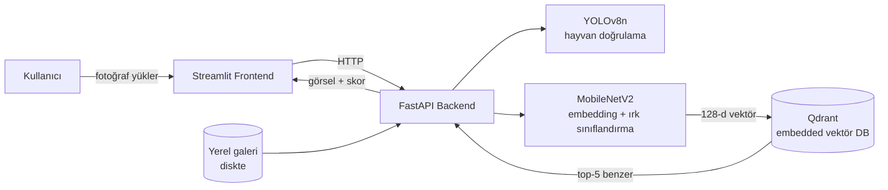

# 🐾 PetFinder AI — Kayıp Evcil Hayvan Bulma Sistemi

Derin metrik öğrenme (deep metric learning) ile çalışan bir görsel benzerlik
motoru: kayıp/bulunan bir evcil hayvanın fotoğrafını yükleyin, sistem ırkını
tahmin etsin ve veritabanındaki en görsel-benzer kayıtları getirsin.

[](https://www.python.org/)
[](https://www.tensorflow.org/)
[](https://fastapi.tiangolo.com/)
[](https://streamlit.io/)
[](https://qdrant.tech/)
[](https://dvc.org/)

> 🚀 **Canlı demo:** şu an yayında değil — bkz. [Dağıtım](#-dağıtım-deploy)

## Nasıl Çalışır?

1. Kullanıcı bir hayvan fotoğrafı yükler.
2. **YOLOv8n** "bekçi model" olarak görselde gerçekten bir kedi/köpek olup
   olmadığını doğrular.
3. **MobileNetV2 tabanlı embedding modeli** (triplet loss ile eğitilmiş)
   görseli 128 boyutlu bir vektöre çevirir ve aynı anda ırk tahmini yapar.
4. Bu vektör, **Qdrant** üzerinde saklanan galeri vektörleriyle karşılaştırılır
   ve en benzer 5 sonuç görsel + meta veriyle birlikte döndürülür.

İki arama modu vardır:
- **🧪 Test:** Demo amaçlı örnek galeri üzerinde arama.
- **🌍 Gerçek İlanlar:** Kullanıcıların "kayıp/bulundu" ilanı olarak yüklediği
  gerçek kayıtlar üzerinde arama (iletişim bilgisiyle birlikte).

## Mimari



Backend, frontend ve vektör veritabanı tek bir konteynerde (veya
docker-compose ile ayrı konteynerlerde) çalışır; harici bulut servisi
(S3, uzak Qdrant sunucusu vb.) **gerektirmez** — bu sayede ücretsiz
barındırma ortamlarında (Hugging Face Spaces gibi) sorunsuz çalışır.

## Model Sonuçları

Oxford-IIIT Pet veri setine benzer 37 sınıflık (kedi/köpek ırkları) veri
üzerinde, triplet loss + sınıflandırma başlığıyla ortak eğitim:

| Metrik | Değer |
|---|---|
| Recall@1 | **83.8%** |
| Recall@5 | **97.0%** |
| Eğitim doğruluğu (classification head) | 92.6% |

Eğitim/deney takibi [DVC](https://dvc.org/) ile pipeline olarak yönetilir
(`dvc.yaml`, `dvc.lock`, `params.yaml`) — veri veya kod değişince
`dvc repro` ile yeniden üretilebilir.

## Proje Yapısı

```
app/
  backend/       FastAPI servisi (model inference, Qdrant, galeri)
  frontend/      Streamlit arayüzü
models/          Eğitilmiş model ağırlıkları (.h5)
tools/           Veri temizleme yardımcı scriptleri
train.py         Triplet loss ile embedding modeli eğitimi (DVC stage)
evaluate.py      Recall@K değerlendirmesi (DVC stage)
dvc.yaml         Eğitim/değerlendirme pipeline tanımı
Dockerfile       Tek konteynerli build (HF Spaces için)
docker-compose.yml  Yerel geliştirme (backend + frontend ayrı konteyner)
```

## Yerel Kurulum

```bash
git clone https://github.com/sametzden/PetFinderAI.git
cd PetFinderAI
cp .env.example .env
docker-compose up --build
```

- Arayüz: http://localhost:8501
- API: http://localhost:8000

İlk açılışta backend, `app/backend/gallery/test/` altındaki örnek görselleri
otomatik olarak vektörleştirip Qdrant'a indeksler.

## Eğitim Pipeline'ı (DVC)

```bash
dvc pull      # Eğitim verisini çek (remote yapılandırması gerekir)
dvc repro     # train + evaluate stage'lerini yeniden çalıştır
dvc metrics show
```

## 🚀 Dağıtım (Deploy)

Uygulama, AWS S3 veya harici bir Qdrant sunucusuna ihtiyaç duymadan tek bir
Docker konteynerinde çalışacak şekilde tasarlandı (bkz. root `Dockerfile`).
Bu sayede AWS'ye bağımlı kalmadan istenildiğinde herhangi bir Docker
barındırma ortamına (Hugging Face Spaces dahil) deploy edilebilir.

`scripts/deploy_hf_space.sh` script'i gerekli dosyaları (`app/`,
`models/*.h5`, `Dockerfile`, `supervisord.conf`) paketleyip bir Hugging
Face Space'in git remote'una push edecek şekilde hazır bekliyor;
şu an aktif olarak kullanılmıyor.

## Bilinen Sınırlamalar

- Hugging Face Spaces'in ücretsiz katmanında disk **kalıcı değildir** —
  Space uykuya girip yeniden başladığında, kullanıcıların yüklediği
  "gerçek ilanlar" ve bunlara ait Qdrant vektörleri silinir. Kalıcılık
  gerekiyorsa Space'e "Persistent Storage" eklenmeli ya da harici bir
  vektör DB (örn. Qdrant Cloud free tier) bağlanmalıdır.
- Backend imajı hem TensorFlow hem PyTorch (YOLO için) içerdiğinden imaj
  boyutu büyüktür; ücretsiz CPU Space'lerde ilk açılış birkaç dakika
  sürebilir.
